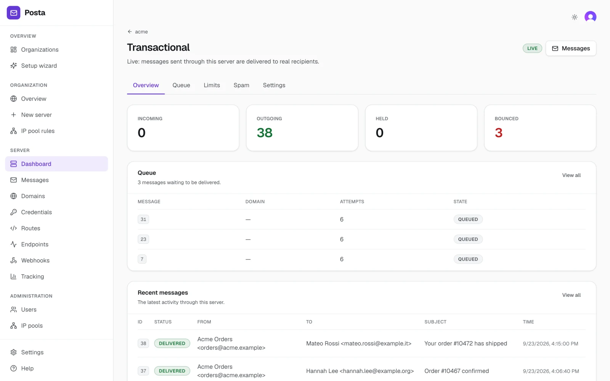
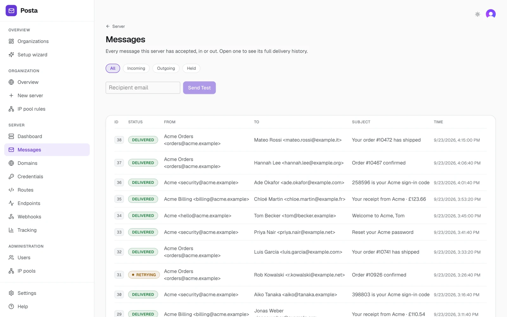
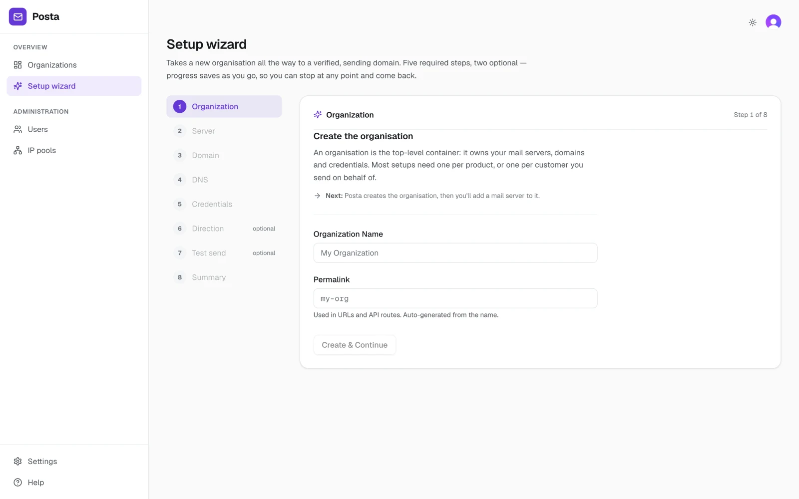
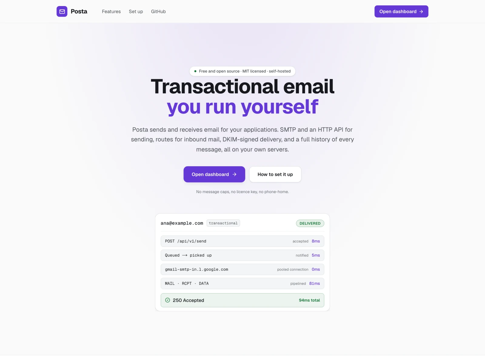

# Posta

**Transactional email you run yourself.** Posta is a self-hosted mail delivery platform: an SMTP server, an HTTP send API, a delivery worker and a dashboard, written in TypeScript on Bun and PostgreSQL.

It's free and MIT-licensed. No message caps, no licence key, no phone-home.

<picture>
  <source media="(prefers-color-scheme: dark)" srcset="docs/screenshots/dashboard-dark.webp">
  
</picture>

## A look around

The screenshots follow your GitHub theme, so you'll see Posta in light or dark mode to match.

### Every message, in and out

The messages list shows everything a mail server has accepted and where each message got to. Temporary failures are retried with backoff, and a hard bounce puts the address on a suppression list.

<picture>
  <source media="(prefers-color-scheme: dark)" srcset="docs/screenshots/messages-dark.webp">
  
</picture>

### From nothing to a verified sending domain

The setup wizard creates an organisation, a mail server, a domain and its DNS records, and the credentials your app sends with. Progress saves as you go, so you can stop and come back.

<picture>
  <source media="(prefers-color-scheme: dark)" srcset="docs/screenshots/setup-wizard-dark.webp">
  
</picture>

### A public site at `/`

Posta serves its own front page covering what it does and how to set it up. The dashboard sits behind sign-in.

<picture>
  <source media="(prefers-color-scheme: dark)" srcset="docs/screenshots/landing-dark.webp">
  
</picture>

## What it does

- **Sending.** An SMTP server and an HTTP API, with separate credentials for every mail server.
- **Receiving.** Routes hand mail for your domains to an HTTP endpoint or forward it over SMTP. Spam scoring comes from Rspamd or SpamAssassin, and ClamAV scans attachments.
- **Deliverability.** Posta generates the SPF, DKIM and MX records for each domain and checks DNS until they resolve. Outgoing mail is DKIM-signed, and hard bounces go on a suppression list.
- **Control.** IP pools, with rules that choose a pool by sender or recipient. Send limits for each server, so one noisy app can't damage the others' reputation.
- **Visibility.** A delivery history with the remote server's response to each attempt. Held messages can be released and failed ones retried. Signed webhooks fire for `MessageSent`, `MessageDelayed`, `MessageDeliveryFailed` and `MessageHeld`.
- **Tracking.** Optional open and click tracking, served from a tracking domain of your own.

The [changelog](CHANGELOG.md) has the full list.

## Quick start

You need Bun 1.3 or newer, PostgreSQL 16 (the Compose file runs one) and a free [Clerk](https://dashboard.clerk.com) application for signing in to the dashboard.

```sh
git clone https://github.com/ChxisB/posta.git
cd posta
bun install
docker compose up -d postgres
cp .env.example .env     # then set NEXT_PUBLIC_CLERK_PUBLISHABLE_KEY and CLERK_SECRET_KEY
bun run start            # the API on 5001, SMTP on 2525 and the delivery worker
bun run start:frontend   # the dashboard on http://localhost:3000
```

Open http://localhost:3000 and create an account. The first account becomes the administrator, and after that only people an administrator adds can sign in. The setup wizard then takes you through to a domain and an API key.

## Sending an email

### Over HTTP

Pass your mail server's API key in the `X-Server-API-Key` header:

```sh
curl http://localhost:5001/api/v1/send \
  -H "X-Server-API-Key: $POSTA_API_KEY" \
  -H "Content-Type: application/json" \
  -d '{
    "from": "orders@acme.example",
    "to": ["maya.patel@example.com"],
    "subject": "Order #10482 confirmed",
    "plain_body": "Thanks for your order. We will email you again when it ships.",
    "html_body": "<p>Thanks for your order. We will email you again when it ships.</p>",
    "tag": "order-confirmation"
  }'
```

Posta queues one message for each recipient and returns their IDs:

```json
{
  "status": "success",
  "time": 0.059,
  "flags": {},
  "data": {
    "message_id": "<f4d8c8d2-5c58-443c-9297-b8c1de8d3ca5@posta>",
    "messages": {
      "maya.patel@example.com": { "id": 43, "token": "56937f6f5c19471b" }
    }
  }
}
```

The same endpoint accepts `cc`, `bcc`, `reply_to`, custom `headers` and `attachments`. To send a message you've already built, `POST /api/v1/send/raw` takes `mail_from`, a `rcpt_to` array and the base64-encoded message as `data`.

### Over SMTP

Point any SMTP client at Posta. The username can be anything, and the password is one of the mail server's SMTP credentials.

```js
import nodemailer from 'nodemailer';

const transporter = nodemailer.createTransport({
  host: 'localhost',
  port: 2525, // 25 in production
  auth: { user: 'posta', pass: process.env.POSTA_SMTP_KEY },
});

await transporter.sendMail({
  from: 'Acme <orders@acme.example>',
  to: 'chloe.martin@example.fr',
  subject: 'Your order has shipped',
  text: 'Good news: your order is on its way.',
});
```

## How it fits together

```
your app ── HTTP ──▶ API ────┐
         ── SMTP ──▶ SMTP ───┴─▶ PostgreSQL ── LISTEN/NOTIFY ──▶ worker ──▶ recipient's mail server
                                                                   └──────▶ your webhooks
```

The API and the SMTP server store each message and queue it in PostgreSQL. The worker picks it up as soon as it's queued, delivers it, records the outcome and calls your webhooks. Each mail server keeps its messages in a PostgreSQL schema of its own.

## Configuration

Posta reads its settings from environment variables or a YAML file. See [the configuration guide](doc/config/configuration.md) and the [full list of environment variables](doc/config/environment-variables.md).

## Contributing

Bug reports, fixes and features are all welcome. [CONTRIBUTING.md](CONTRIBUTING.md) covers how the code is laid out, running the tests and opening a pull request.

## Licence

[MIT](LICENSE) © Chris Beckett
